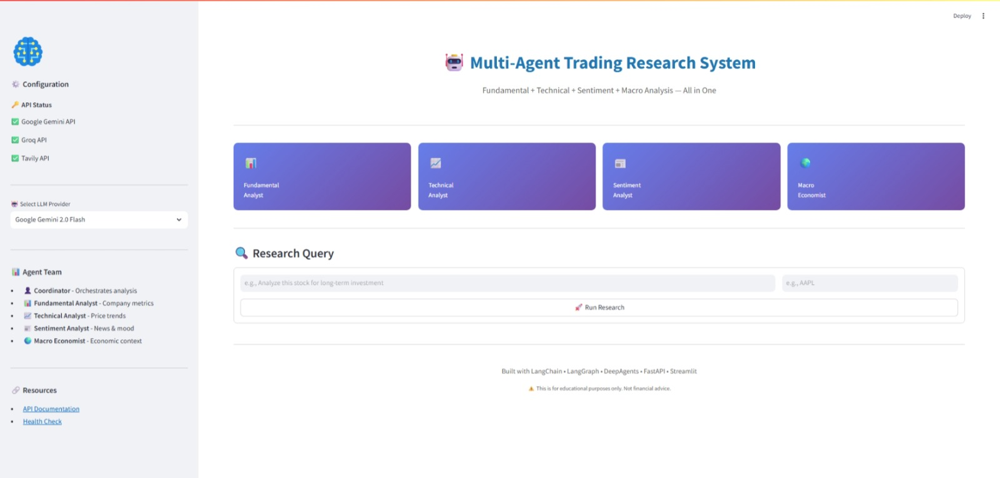
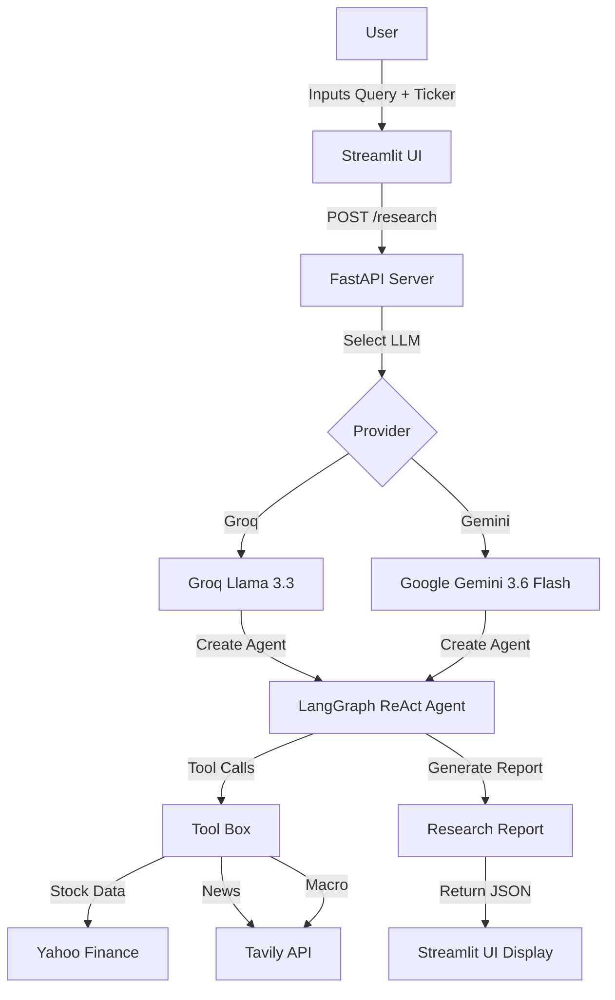

# 🤖 Multi-Agent Trading Research System

<p align="center">
  
  
  
  
  
  
  
</p>

> **An AI-powered Multi-Agent Trading Research System combining Fundamental, Technical, Sentiment, and Macro Analysis — powered by LangGraph ReAct Agent, FastAPI, and Streamlit.**


## 🖥️ UI Screenshot



*"4 AI agents collaborate in real-time to provide comprehensive stock analysis."*


---

## 📌 Table of Contents

- [Overview](#-overview)
- [Key Features](#-key-features)
- [Tech Stack](#-tech-stack)
- [Architecture Flow](#-architecture-flow)
- [Getting Started](#-getting-started)
- [How to Test](#-how-to-test)
- [Project Structure](#-project-structure)
- [API Endpoints](#-api-endpoints)
- [Frequently Asked Questions](#-frequently-asked-questions)
- [Future Improvements](#-future-improvements)
- [Contributing](#-contributing)
- [License](#-license)
- [Acknowledgements](#-acknowledgements)
- [Connect with Me](#-connect-with-me)
- [Disclaimer](#-disclaimer)

---

## 🚀 Overview

**Multi-Agent Trading Research System** is a production-ready AI application that uses **4 specialized AI agents** to analyze stocks from multiple perspectives:

| Agent | Role | Tools Used |
| :--- | :--- | :--- |
| **📊 Fundamental Analyst** | Company financials, ratios, valuation, balance sheet | `get_stock_info` |
| **📈 Technical Analyst** | Price trends, support/resistance, indicators (RSI, MACD) | `get_stock_history` |
| **📰 Sentiment Analyst** | News, social media, market mood, analyst ratings | `get_news` |
| **🌍 Macro Economist** | Interest rates, inflation, GDP, global context | `search_macro_indicators` |

All agents work together under a **Coordinator** (orchestrator) to deliver a comprehensive, data-driven research report.

---

## ✨ Key Features

| Feature | Description |
| :--- | :--- |
| **🤖 4 Specialized AI Agents** | Each agent focuses on one analytical domain |
| **🔀 Dual LLM Support** | Choose between **Google Gemini 3.6 Flash** or **Groq Llama 3.3 70B** |
| **📊 Real-Time Financial Data** | Yahoo Finance for stock info, Tavily for news |
| **🖥️ Beautiful Streamlit UI** | Interactive dashboard with agent cards and report display |
| **⚡ FastAPI Backend** | Scalable REST API with `/research` endpoint |
| **🧠 LangGraph ReAct Agent** | Tool calling, memory, and reasoning |
| **🛡️ Rate Limit Handling** | Graceful handling of API quota errors (429) |
| **💾 Report Export** | Download research reports as Markdown |
| **🔗 API Documentation** | Auto-generated Swagger UI at `/docs` |
| **📊 Health Check** | Monitor API status and key availability |

---

## 🛠️ Tech Stack

| Layer | Technology | Version |
| :--- | :--- | :--- |
| **Orchestration** | LangGraph + LangChain | 0.2.50 / 0.3.0 |
| **LLM Backend** | Google Gemini 3.6 Flash / Groq Llama 3.3 | — |
| **Backend API** | FastAPI | 0.115.0 |
| **Frontend UI** | Streamlit | 1.38.0 |
| **Financial Data** | yfinance | 0.2.43 |
| **News Data** | Tavily API | 0.5.0 |
| **Environment** | python-dotenv | 1.0.1 |
| **Validation** | Pydantic | 2.9.0 |
| **HTTP Client** | httpx | 0.27.2 |

---

## 📦 Architecture Flow



---

## 🏁 Getting Started

### Prerequisites

- **Python 3.11+**
- **Google Gemini API Key** (Free Tier) — [Get here](https://aistudio.google.com/apikey)
- **Groq API Key** (Free Tier) — [Get here](https://console.groq.com)
- **Tavily API Key** (Free Tier) — [Get here](https://tavily.com)

### 1. Clone & Setup

```bash
git clone https://github.com/vaibhav07772/trading-research-agent.git
cd trading-research-agent
```

### 2. Create Conda Environment

```bash
conda create -n trading-agent python=3.11 -y
conda activate trading-agent
```

### 3. Install Dependencies

```bash
pip install -r requirements.txt
```

### 4. Set Environment Variables

Create a `.env` file in the project root:

```env
# Required
GOOGLE_API_KEY=AIzaSy...
GROQ_API_KEY=gsk_...
TAVILY_API_KEY=tvly-...

# Optional
MODEL_PROVIDER=groq  # or gemini
```

### 5. Run the Application

**Terminal 1 (FastAPI Backend):**

```bash
python main.py
```

*(FastAPI runs on `http://127.0.0.1:8000`)*

**Terminal 2 (Streamlit UI):**

```bash
streamlit run app.py
```

*(Streamlit runs on `http://localhost:8501`)*

### 6. Access the Application

| Resource | URL |
| :--- | :--- |
| **Streamlit UI** | `http://localhost:8501` |
| **API Docs** | `http://127.0.0.1:8000/docs` |
| **Health Check** | `http://127.0.0.1:8000/health` |

---

## 🧪 How to Test

1. **Open Streamlit UI** at `http://localhost:8501`
2. **Select LLM Provider** (Groq or Gemini) from the sidebar
3. **Enter Research Question** — e.g., *"Analyze Apple stock for investment"*
4. **Enter Ticker** — e.g., `AAPL`
5. Click **🚀 Run Research**
6. **Wait 30-60 seconds** as 4 agents analyze from their domains
7. **View Report** — Executive Summary, Fundamental, Technical, Sentiment, Macro, Risk, and Final Recommendation
8. **Download** the report as Markdown

### Sample Queries

| Query | Ticker |
| :--- | :--- |
| "Should I buy Apple stock?" | AAPL |
| "Analyze Tesla's growth potential" | TSLA |
| "Is NVIDIA a good investment?" | NVDA |
| "Compare Microsoft and Google" | MSFT, GOOGL |

---

## 📂 Project Structure

```
trading-research-agent/
├── main.py                   # FastAPI Server Entry
├── app.py                    # Streamlit UI          
├── .env                      # Environment variables
├── requirements.txt          # Dependencies
├── tools/                    # Separate tool modules
│   ├── __init__.py
│   ├── stock_tools.py        # Yahoo Finance
│   ├── news_tools.py         # Tavily News
│   └── macro_tools.py        # Macro indicators
├── utils/                    # Helper functions
│   ├── __init__.py
│   └── helpers.py
└── README.md
```

---

## 📡 API Endpoints

| Method | Endpoint | Description |
| :--- | :--- | :--- |
| `GET` | `/` | Root endpoint — service status |
| `GET` | `/health` | Health check with API key status |
| `POST` | `/research` | Submit research query |
| `GET` | `/docs` | Swagger UI documentation |
| `GET` | `/redoc` | ReDoc documentation |

### POST `/research` — Request Body

```json
{
  "query": "Analyze Apple stock for long-term investment",
  "ticker": "AAPL",
  "model": "groq"
}
```

### POST `/research` — Response

```json
{
  "success": true,
  "response": "## Executive Summary\n...",
  "ticker": "AAPL",
  "timestamp": "2026-01-15T10:30:00",
  "error": null
}
```

---

## ❓ Frequently Asked Questions

### Q1: Which LLM provider should I use?

| Provider | Speed | Quality | Rate Limits | Best For |
| :--- | :--- | :--- | :--- | :--- |
| **Groq** | ⚡⚡⚡ (Fast) | 🟢 High | 30 req/min | General analysis |
| **Gemini 3.6 Flash** | ⚡⚡ (Medium) | 🔵 Very High | 60 req/min | Complex reasoning |

### Q2: What if I hit rate limits?

- **Switch providers** — If Gemini is rate-limited, switch to Groq.
- **Wait 1-2 minutes** — Quota resets automatically.
- **Check API keys** — Ensure `.env` keys are correctly set.

### Q3: Why am I getting 404 errors with Gemini models?

**Solution:** Update the model name in `main.py`:

```python
model="gemini-3.6-flash"  # Currently available
```

### Q4: How do I update dependencies?

```bash
pip install --upgrade langchain-google-genai google-generativeai langchain-groq
```

### Q5: Is this for real investment advice?

**No.** This is for **educational purposes only**. Never make real investment decisions based on AI-generated reports without consulting a licensed financial advisor.

### Q6: Can I add more agents?

Yes! Just create a new tool function and add it to the agent's tool list in `main.py`.

### Q7: Why is my Tavily search not working?

- Check that `TAVILY_API_KEY` is correctly set in `.env`
- Ensure you have Tavily credits (free tier gives 1000 requests/month)
- Verify your internet connection

---

## 🔮 Future Improvements

- [ ] **Multiple Timeframes** — Support 1d, 1wk, 1mo, 1yr analysis
- [ ] **Crypto Support** — Bitcoin, Ethereum, etc.
- [ ] **Sector Analysis** — Auto-detect and compare with peers
- [ ] **PDF Report Export** — Export as PDF instead of Markdown
- [ ] **Real-time WebSocket** — For live price updates
- [ ] **Multi-User Authentication** — Separate chat histories
- [ ] **Docker Deployment** — One-click deploy
- [ ] **LangSmith Monitoring** — Track agent performance
- [ ] **Backtesting Integration** — Test recommendations against historical data
- [ ] **Portfolio Management** — Track multiple stocks simultaneously

---

## 🤝 Contributing

Pull requests are welcome! For major changes, please open an issue first.

### Code Style

- Use `black` for formatting
- Use `isort` for import sorting
- Write docstrings for all functions

### Development Workflow

```bash
# Install development dependencies
pip install black isort

# Format code
black .
isort .

# Run tests (when added)
pytest
```

---

## 📜 License

MIT License — Feel free to use, modify, and distribute.

---

## 🙏 Acknowledgements

- [LangChain / LangGraph](https://langchain.com) — Agent orchestration
- [Google Gemini](https://deepmind.google/technologies/gemini/) — LLM backend
- [Groq](https://groq.com) — Fast LLM inference
- [Streamlit](https://streamlit.io) — Beautiful UI
- [Yahoo Finance](https://finance.yahoo.com) — Stock data
- [Tavily](https://tavily.com) — News and search API
- [FastAPI](https://fastapi.tiangolo.com) — High-performance API framework

---

## 📬 Connect with Me

**Author:** Vaibhav Singh  
**GitHub:** [vaibhav07772](https://github.com/vaibhav07772)  
**LinkedIn:** [Vaibhav Singh](https://linkedin.com/in/vaibhav-singh-9a9b9434a)  
**Email:** vs9502778@gmail.com

> *"Building intelligent, data-driven systems with AI agents."*

---

## ⚠️ Disclaimer

**Educational Purpose Only** — This is a demonstration project. The information provided by this system is for educational and research purposes only. It does not constitute financial advice. Always consult with a qualified financial advisor before making any investment decisions.

---

## 🔗 Quick Links

| Resource | URL |
| :--- | :--- |
| **Streamlit UI** | `http://localhost:8501` |
| **API Docs** | `http://127.0.0.1:8000/docs` |
| **Health Check** | `http://127.0.0.1:8000/health` |
| **GitHub Repo** | `https://github.com/vaibhav07772/trading-research-agent` |

---

> *"4 Agents. 1 Report. Zero Headache."* 🚀

---

## ⭐ Star This Project

If you find this project useful, please give it a star on GitHub! ⭐

[](https://github.com/vaibhav07772/trading-research-agent)